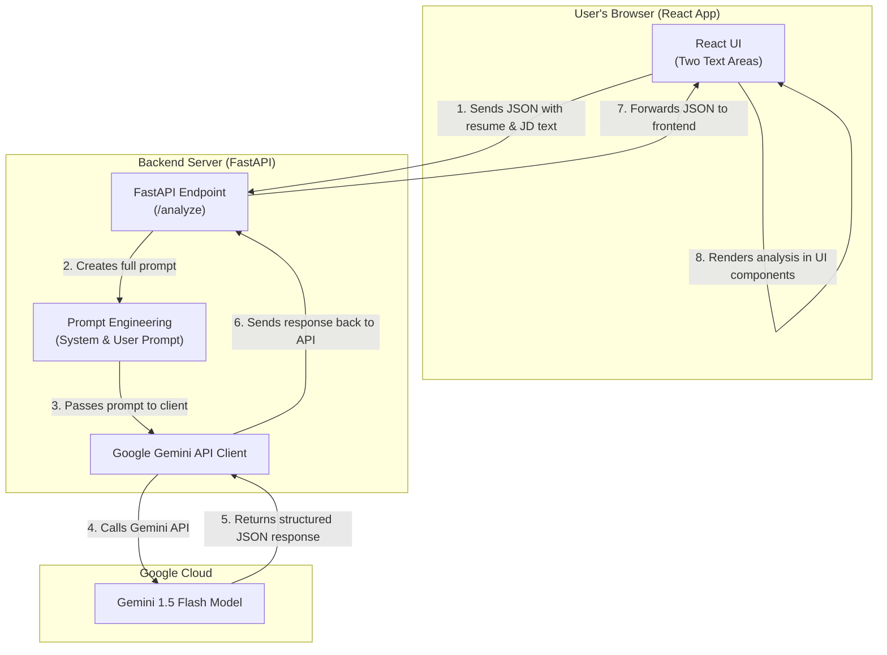

# AI-Powered Resume Analyzer

A full-stack web application that provides a detailed analysis of how well a resume matches a given job description, using Google's Gemini LLM.

This project showcases skills in full-stack development, prompt engineering, and practical LLM integration for a data-driven, real-world use case.

## Screenshot

[Image](https://github.com/user-attachments/assets/9ae7c4d1-d27c-49b7-996d-043f052715d2) 
---

## Features

-   **Side-by-Side Analysis:** Easily paste a resume and job description into two large text areas.
-   **Quantitative Scoring:** Get an instant "Match Score" to quickly gauge candidate suitability.
-   **AI-Generated Summary:** Read a brief, expert summary of the candidate's overall fit.
-   **Detailed Skill Breakdown:** See which key skills from the job description are present on the resume and which are missing, presented in clear, color-coded lists.

---

## Tech Stack & Architecture

-   **Frontend:**
    -   **React.js:** For building the dynamic and responsive user interface.
    -   **Axios:** For handling asynchronous API requests to the backend.
    -   **CSS3:** For custom styling of the UI components and results display.

-   **Backend:**
    -   **Python 3:** As the core programming language.
    -   **FastAPI:** A high-performance web framework for the API.
    -   **Pydantic:** For data validation and defining clear request/response models.
    -   **Uvicorn:** An ASGI server to run the FastAPI application.

-   **AI & Cloud:**
    -   **Google Gemini Pro:** The large language model used for the analysis.
    -   **Google AI SDK:** The official Python client for interacting with the Gemini API.
    -   **Dotenv:** For securely managing the Google API Key.

---

## System Architecture & Data Flow

The application uses a client-server architecture. The React frontend captures user input and sends it to the FastAPI backend, which then orchestrates the call to the external Google Gemini API.



The core of the backend logic lies in the `SYSTEM_PROMPT` sent to the LLM, which strictly instructs it to return its analysis in a specific JSON format, ensuring reliable data parsing.

---

## Setup and Installation

To run this project locally, you will need `Python 3.8+` and `Node.js v14+` installed.

### 1. Backend Setup

Navigate to the `backend` directory, create a virtual environment, and install the dependencies.

```bash
cd backend

# Create and activate a virtual environment
python -m venv venv
source venv/bin/activate  # On Windows: .\\venv\\Scripts\\activate

# Install Python packages
pip install -r requirements.txt
```
*(I will create the `requirements.txt` file for you in the next steps.)*

**Important:** You must create a `.env` file in the `backend` directory and add your Google Gemini API key:
```
# backend/.env
GOOGLE_API_KEY="YOUR_API_KEY_HERE"
```

### 2. Frontend Setup

In a separate terminal, navigate to the `frontend` directory and install the Node.js dependencies.

```bash
cd frontend
npm install
```

### 3. Running the Application

-   **Start the Backend Server:** From the `backend` directory (with the virtual environment activated):
    ```bash
    uvicorn main:app --reload
    ```
    The API will be available at `http://localhost:8000`.

-   **Start the Frontend Server:** From the `frontend` directory:
    ```bash
    npm start
    ```
    The application will open in your browser at `http://localhost:3000`. 